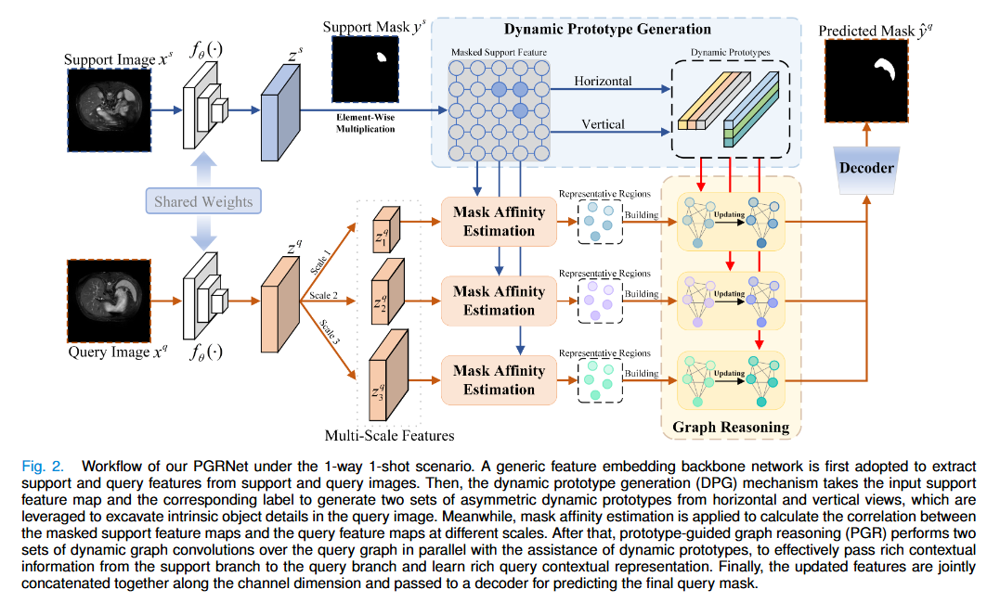
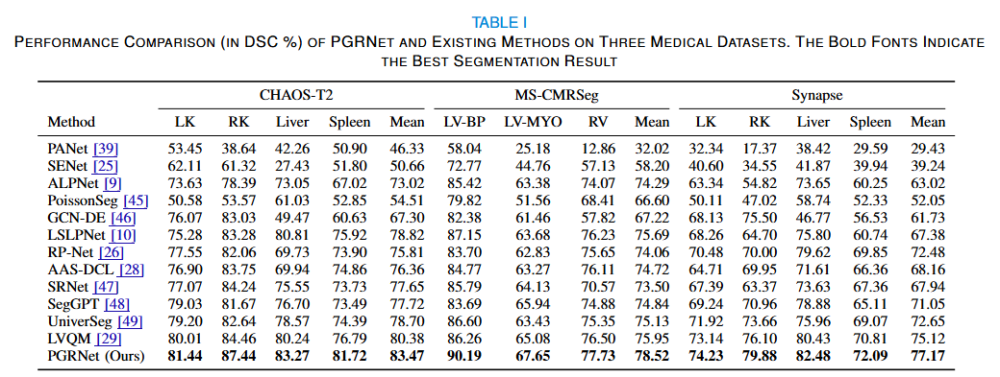
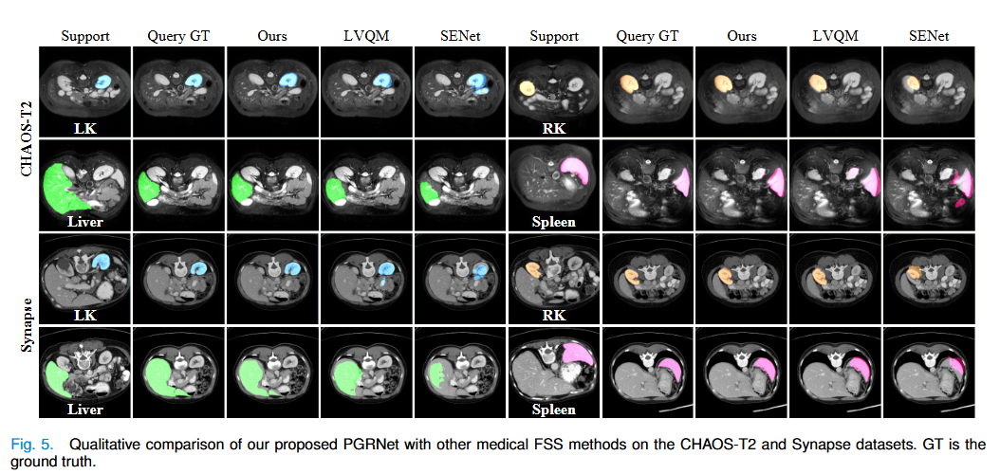

<h2 align="center">Prototype-Guided Graph Reasoning Network for Few-Shot Medical Image Segmentation</h2>
<h4 align="right">by <a href="https://scholar.google.com/citations?user=q0syMZQAAAAJ&hl=en">Wendong Huang </a>, <a href="https://fhujinwu.github.io/">Jinwu Hu</a>, <a href="https://scholar.google.com/citations?user=5zRSaQcAAAAJ&hl=en&oi=ao">Junhao Xiao</a>, Yang Wei, <a href="https://scholar.google.com/citations?hl=en&user=1Ezgfw8AAAAJ">Xiuli Bi</a>, <a href="https://faculty.cqupt.edu.cn/xiaobin/zh_CN/index.htm">Bin Xiao*</a></h4>

<div align="center">
  <br><br>
</div>
<div align="center">
  <br><br>
</div>
<div align="center">
  <br><br>
</div>


## Citation
If you use PGRNet in your research, please cite our IEEE Transactions on Medical Imaging paper.

```text
@ARTICLE{10680137,
  author={Huang, Wendong and Hu, Jinwu and Xiao, Junhao and Wei, Yang and Bi, Xiuli and Xiao, Bin},
  journal={IEEE Transactions on Medical Imaging}, 
  title={Prototype-Guided Graph Reasoning Network for Few-Shot Medical Image Segmentation}, 
  year={2024},
  volume={},
  number={},
  pages={1-1},
  doi={10.1109/TMI.2024.3459943}}


```
